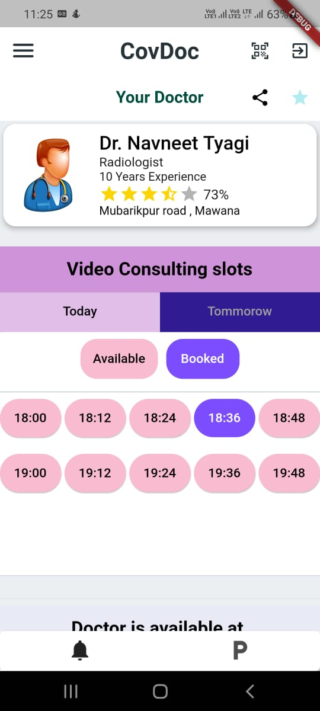
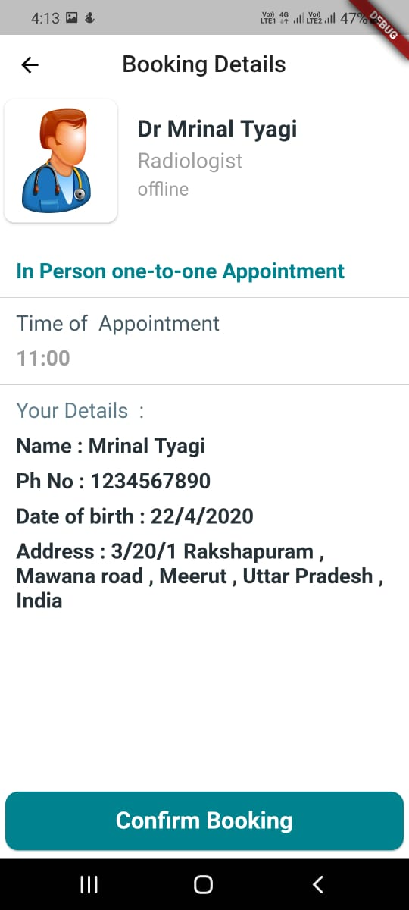
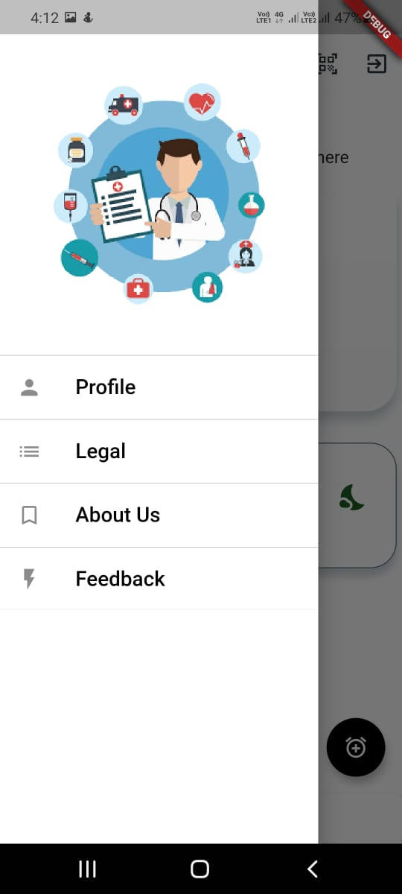
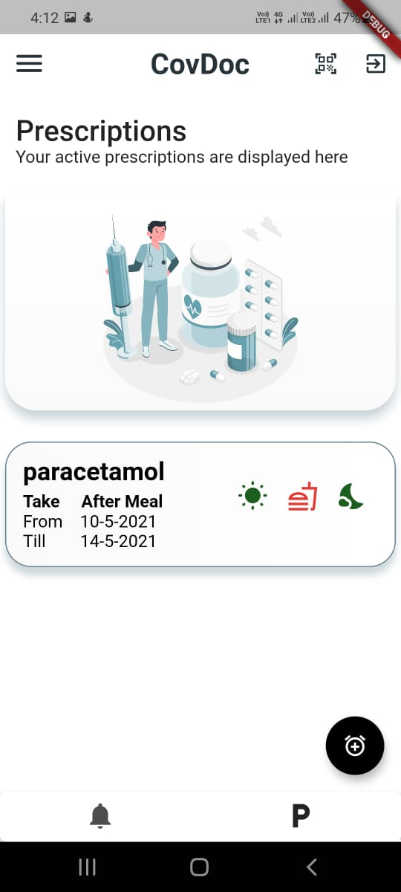
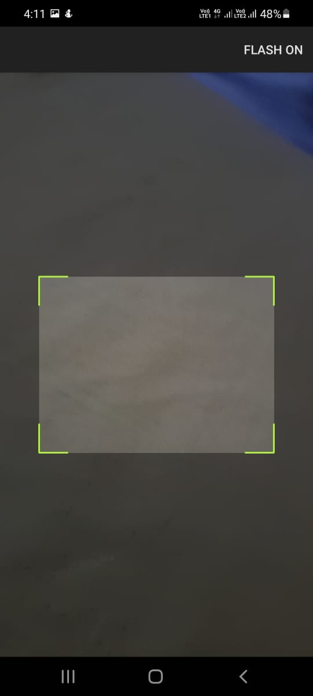

# CovDoc

## An app to reduce hassle to acquire COVID-19 support

### Video Link

- YouTube: <https://www.youtube.com/watch?v=_2UbGazouKE>
- Drive: <https://drive.google.com/drive/u/1/folders/1vVEo7YXjSKnhYWnkFDeXP3zqEfcYh6Oz>

### Installation

- Install Flutter 1.23.0-18.1.pre, channel beta from <https://flutter.dev/docs/development/tools/sdk/releases>.
- Clone our repo and cd into it.
- run `flutter pub get`.
- run `flutter run` after connecting your mobile device by USB.
- try various features of our app.

### Screenshots

- **Make Video Calls**
- 

- **View free slots**
- 

- **Book Appointments**
- 

- **Clutter-free UI/UX**
- 

- **View pending prescriptions**
- 

- **Scan Qr-Codes**
- 
